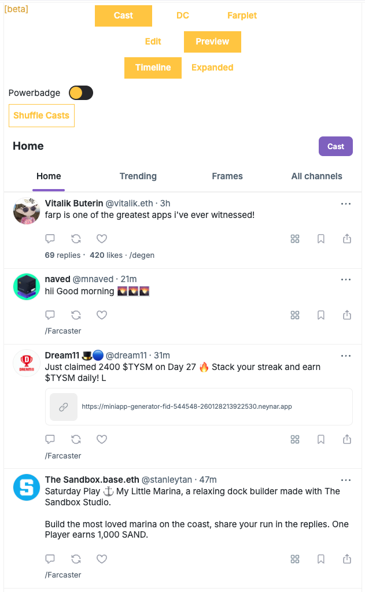

# farp

A social feed interface built to match Warpcast's UI, then made editable. Load a real Farcaster
feed, then rewrite any cast in place — author, avatar, handle, body text, timestamp, engagement
counts — and flip to Preview to see the result rendered as the real client would.

Three surfaces: **Cast** (feed and single-cast views), **DC** (direct message threads) and
**Farplet** (a token-balance mini app). Each has an Edit and a Preview mode, and the feed renders
in Timeline or Expanded layouts.

Built as a Farcaster mini app, and works standalone in a normal browser.

**Live:** https://farp.vercel.app

## Stack

Next.js (App Router), React, TypeScript, Tailwind CSS, Lexical and Draft.js for the inline cast
editor, Radix UI, Neynar SDK for Farcaster data, wagmi/viem and the Farcaster Frame SDK for
wallet context, `@vercel/og` for share images. Deployed on Vercel.

## references/

Saved reference markup from the Warpcast client — `Cast.html`, `Convo.html`, `Nav.html`,
`ComposeReply.html`. These are the comps the components were built against, kept in the repo so
the layout work can be checked against its source.

## coin price APIs

### Dexscreener
Search for pairs matching query (rate-limit 300 requests per minute)
https://api.dexscreener.com/latest/dex/search?q=<query>

### Hyperliquid
Get prices for native tokens like ETH, BTC, SOL, HYPE etc.
https://api.hyperliquid.xyz/info

### CoinGecko
The CoinGecko Demo API plan has a rate limit of 30 calls/min, while paid plans offer a higher rate limit of 500 to 1,000 calls/min.
https://www.coingecko.com/en/api

### 0x
The current limit for the Free Tier of our APIs is approximately 10 Requests Per Second (RPS).
https://0x.org/docs/developer-resources/rate-limits#what-are-the-rate-limits-for-the-0x-apis
https://0x.org/pricing
